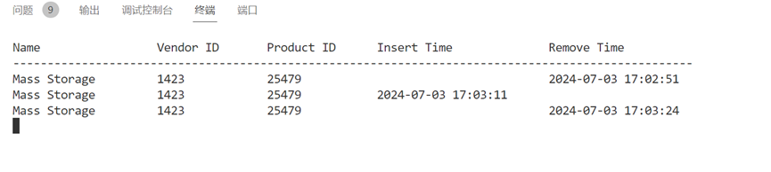

### 程序

驱动程序的主要流程：
    注册一个usb事件回调函数，事件发生，将消息写入队列，并唤醒。
    模块的读操作等待队列，将事件copy给用户。
    实现poll。
    提供开关接口。
用户端：
    初始化epoll
    主循环里面等待并读取，刷新显示。

### 用法
使用  sudo insmod usb_monitor.ko加载模块。
sudo ./user_usb_app 进入信息监听状态
	插入，拔出usb设备。
	使用lsmod查看当前加载的模块
	使用sudo rmmod usb_monitor卸载模块
    
### 结果
